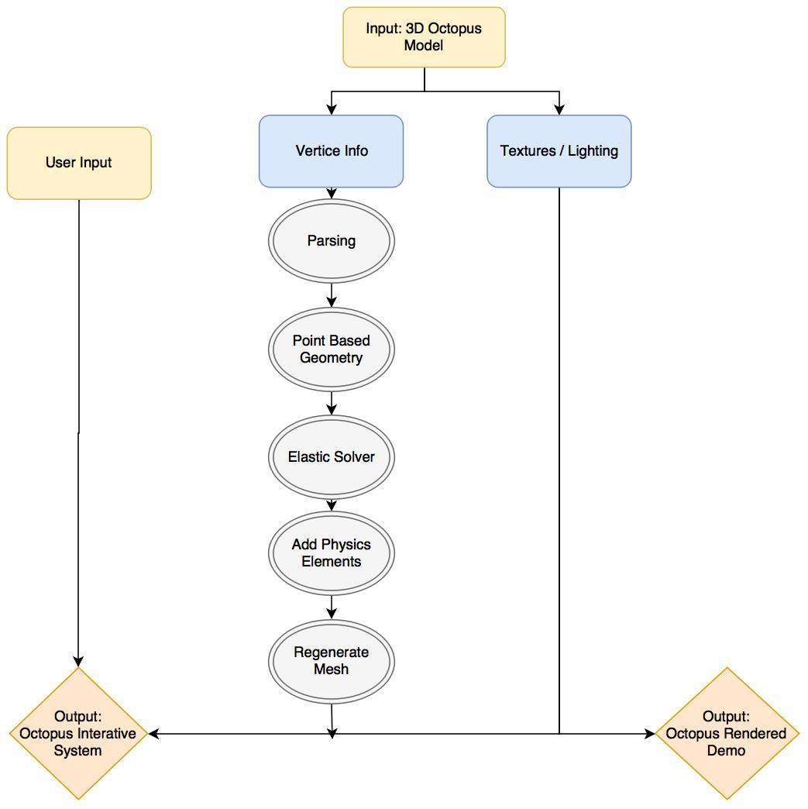

# Octopus - Final Project Proposal

### Problem statement / goals
Octopus is a mysterious animal. Its body is elastic and has no internal or external skeletons, so it has no problem using extreme deformation to squeeze through tight places. Among many other interesting and difficult problems to solve about Octopus, mimicking this elastic property is a charming one to explore in Computer Graphics. 

The application of point-based techniques is explained in [1].  According to it, point sampled objects do neither have to store nor to maintain globally consistent topological information, which makes it more ideal than triangle meshes when it comes to handling dynamic changing shapes in this case. In this project, we want to use this point-based technique to best represent the elastic property of the octopus, and demonstrate it through simple interactions.

### Approach
We want to first use this method explained in [1](https://pdfs.semanticscholar.org/1dd4/d072dfbd3225e5fb7a36f9c093ff9d6915f8.pdf) to represent the octopus mesh, then add the elastic material property described in [2](https://cg.inf.ethz.ch/Downloads/Publications/Papers/2004/Mue04c/Mue04c.pdf), and finally, if time permits, handle contact with the approach in [3](http://matthias-mueller-fischer.ch/publications/cd_pba04.pdf).

The system will input an obj file of the octopus model. It will first use its geometry info to build a point-based model, then add elastic properties to the points. The physics system will iterate over every point per frame and update the point’s status. After that the mesh will be regenerated.
To demonstrate the result, we will render several animation demos and also create a program that you can interact with the octopus.

### Resources
We are going to use Processing for this project. It is a flexible software sketchbook and a language that has OpenGL integration for accelerated 3D. It is open source and people around the world are contributing to this project. It is great for creating interactions and has libraries to handle 3D rendering. 
We will use some of the processing libraries. Here are the ones we choose:
- Particle Flow, a Processing/Java library for high performance GPU-Computing (GLSL). It has a renderer that can save us time to build. 
- Peasy Cam, a mouse driven camera-control library for 3D sketches. 
We may use more libraries, mostly to add fun interactions. 
Things we must create by ourselves:
- Convert model to point based geometry
- Add elastic properties
- If time permits, handle the contact for point based objects

We will first use an octopus model from the internet, and focus on the algorithm. If we have time left we will build our own octopus.

### Demo
We will have a user interface that provides different attribute controllers and an octopus model that users can play with. 

### Timeline

*Date* | *Milestone*
--- | ---
Apr.10 | - 3D view controlling   - Basic coding structure   - Model loading and converting
Apr.20 | - Adding elastic properties   - Adding user interface
May.1 | - Texturing, Lighting, Rendering   - Explore contact handling

### Reference
[[1] Kobbelt L, Botsch M. A survey of point-based techniques in computer graphics[J]. Computers & Graphics, 2004, 28(6): 801-814.](https://pdfs.semanticscholar.org/1dd4/d072dfbd3225e5fb7a36f9c093ff9d6915f8.pdf)
[[2] Müller M, Keiser R, Nealen A, et al. Point based animation of elastic, plastic and melting objects[C]//Proceedings of the 2004 ACM SIGGRAPH/Eurographics symposium on Computer animation. Eurographics Association, 2004: 141-151.](https://cg.inf.ethz.ch/Downloads/Publications/Papers/2004/Mue04c/Mue04c.pdf)
[[3] Hetdelherger R K M M B, Gross M T M. Contact handling for deformable point-based objects[C]//Vision, Modeling, and Visualization 2004: Proceedings, November 16-18, 2004, Standford, USA. IOS Press, 2004: 315.](http://matthias-mueller-fischer.ch/publications/cd_pba04.pdf)
