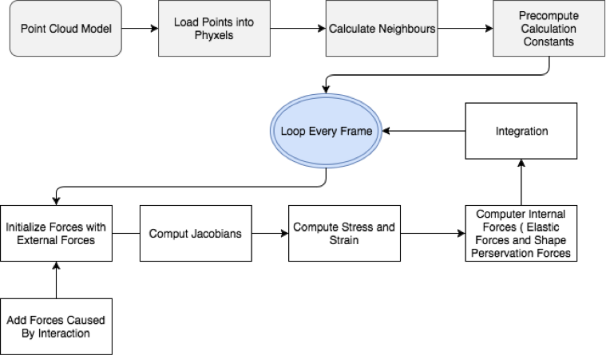
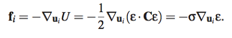
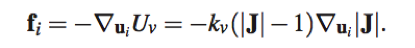
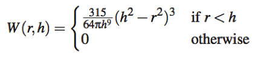
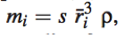
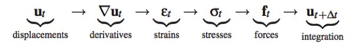
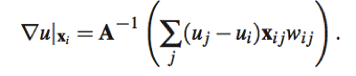
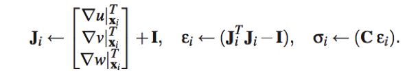
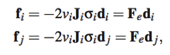
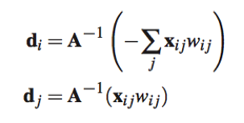

# Octopus - Final Project Proposal

### Problem statement / goals
Octopus is a mysterious animal. Its body is elastic and has no internal or external skeletons, so it has no problem using extreme deformation to squeeze through tight places. Among many other interesting and difficult problems to solve about Octopus, mimicking this elastic property is a charming one to explore in Computer Graphics. 

The application of point-based techniques is explained in [[1]](#1). According to it, point sampled objects do neither have to store nor to maintain globally consistent topological information, which makes it more ideal than triangle meshes when it comes to handling dynamic changing shapes. 
In this project, we want to use this point-based technique to best represent the elastic material of the octopus, and demonstrate it through simple interactions.

### Approach
We first convert an octopus model into point cloud, and input it into the program. We then follow the steps described in [[2]](#2) to model the elastic property. To demonstrate the result, we add interaction to drag points around and see what happens to the whole model.

- Overview
Here’s an overview of the program structure: 

We load the model into phyxels. A phyxel is a physics unit. It contains all the information about the physics status, for example the original position (material coordinate), displacement, force and velocity.
The foundation of this project is the Elasticity Model. We calculate two types of energy on each phyxel, and them to calculate corresponding forces. One type of energy is the elastic force. It means, when one point has a displacement, it drags all its neighbor points around and also get a resistant force from the neighbors. It is calculated as follow:

where u is the displacement, U is the elastic energy, ε is the strain, C is a rank four tensor and σ is the stress.
Another energy is the volume conservation energy. It works as a spring to drag the phyxels back to their matrial coordinates. It is calculated as follow: 

where kv is a constant, J is the Jacobian of displacement, u and U are the displacement and energy.
The algorithm relies on a balance of these two forces, and the physics parameters are quite important. 

- Initialization

We need to first initialize the phyxels’ constants. The mesh – free model is not simply points without connections. Every point/phyxel has its mass, density and volume. The mass is distributed around the phyxel with the following distribution function:

where r is the distance to the phyxel and h is the support of the kernel, which is set to 3 * average_r for each phyxel in our case. At first, we need to input a mass density. Then the mass density on each point needs to be initialized as  so that it is close to the mass density we input. We calculate volume by dividing mass by the density.

- Update 

The update step is as follow:  

We will not go very deep about explaining the mathematics. 
The derivatives are calculated by:

 
Using this we can compute 

 
Finally, we calculate the forces by

 
where
 

- Physics Parameters

Besides understanding the algorithm, the biggest challenge for us were understanding the physics parameters. All the physics parameters that can be adjusted in our algorithms are:
*  Time step, which needs to be very small (e.g. 1/60).
*   Young’s Modulus and Poisson Ratio are the parameters for elasticity model. In the paper, Young’s Modulus is 10^5 – 10^9, and we looked up Poisson Ratio to be between -1 and 0.5. However, we didn’t get a stable result from these parameters. 
*   Damping, for adding a damping force according to velocity 
*   Kv, a constant used to calculate volume preservation force.
*   Mass Density of the model.

### Result
We switched the platform at last because of some issue we cannot solve in Processing. The following is the OpenGL result.
Here’s the point-based Octopus. The model is not volumetric so it looks a little hollow, but it still shows elasticity property.

We couldn’t make volumetric point cloud model because of the limitation on the number of points. So here we demonstrate a cube with the volumetric point cloud and the result is better.

### Resources
We used Processing with Java for this project for its great interaction features. However, when we come to realize it, we encountered some problems that’s hard to solve. Because of that, we switched to Opengl with C++.
Here’re the processing libraries we used:
*   Peasy Cam, a mouse driven camera-control library for 3D sketches.
*   HE_Mesh, a library to load models and has math functions
Here’s the C++ libraries we used:
*   glm, opengl mathematics
*   glut, opengl utility toolkit
*   glew, opengl extension wrangler library
The octopus we used is from the internet: on Sketchfab by Lukáš Marek

### Problem Encountered
*   Loading Model
There are 2 problems we encountered with loading the model. 
At first we were trying to load .obj and convert the vertex into phyxels. However, we found that the number of points of the loaded model doesn’t seems to match the original one. It is because when processing load the model, it treats the same point on different faces as different points and load them multiple times. It is solved by using the HE_Mesh library. 
The other problem was that we can not run the program real time with a lot of points. The processing version can support about 7000 points, and the opengl version crashes on over 1000 points. Because of this, we have to lower our point cloud density. This makes it impossible to run the simulation on a fairly high-poly octopus that has good shape, and we can’t make the point cloud volumetric. As a result, the octopus’ big head is not as elastic as the other parts because it has less density.

*   Model Density
The point cloud of the model needs to have high density. Every phyxel needs to have more than 4 neighbors to be stable. Surface with low density will explode easily, and volumetric point cloud have better elastic behavior.

*   Processing Explosion Problem
In the middle of the project, we encountered a problem that neither of us were able to solve. In the processing version, the points of the model will vibrate around its material coordinates. This caused more displacement force and make the whole model vibrate more, and finally exploded. 
We looked at this problem in different ways. We thought it could be integration problem and tried to use verlet integration instead of leap frog. It didn’t solve the problem.
We then think it is because our weight function was not normalized, and made the elasticity force too big. We tried to normalize it but it only makes the time before explosion longer. 
We also begin to look at the physics parameters. One of the thing we found was that Young’s modulus was very small in another realization about FEM flock. We tried to use smaller parameter but it still didn’t work.
Finally we switched to OpenGL and it solve the problem. We guess it is because of the library we use have some accuracy issue.

Here we enclose a video of the issue in the Processing version:

### Pros and Cons of the System
The implementation of the system is simple and straightforward. The algorithm can be easily applied to other models with enough point density but not so many points. 
The system requires very small time step.

### Improvement if have time
1.  Make the interface better for adjusting parameters, and find several sets of parameters that works well. After that do a comparison and show the difference made by different parameters.
2.  Rebuild the model from point cloud.
3.  Try to implement it on GPU and increase its capacity for handling points.

### Reference
[[1] Kobbelt L, Botsch M. A survey of point-based techniques in computer graphics[J]. Computers & Graphics, 2004, 28(6): 801-814.](https://pdfs.semanticscholar.org/1dd4/d072dfbd3225e5fb7a36f9c093ff9d6915f8.pdf)

[[2] Müller M, Keiser R, Nealen A, et al. Point based animation of elastic, plastic and melting objects[C]//Proceedings of the 2004 ACM SIGGRAPH/Eurographics symposium on Computer animation. Eurographics Association, 2004: 141-151.](https://cg.inf.ethz.ch/Downloads/Publications/Papers/2004/Mue04c/Mue04c.pdf)
